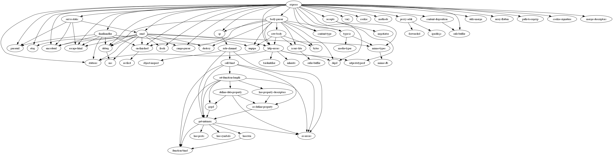

# Задание
Разработать инструмент командной строки для визуализации графа зависимостей, включая транзитивные зависимости. Сторонние средства для получения зависимостей использовать нельзя.

Зависимости определяются по имени пакета языка **JavaScript (npm)**. Для описания графа зависимостей используется представление **Graphviz**. Визуализатор должен выводить результат на экран в виде кода.
___
Конфигурационный файл имеет формат **csv** и содержит:
1. Путь к программе для визуализации графов.
2. Имя анализируемого пакета.
3. Путь к файлу-результату в виде кода.
4. URL-адрес репозитория.

Все функции визуализатора зависимостей должны быть покрыты тестами.
___
### Структура конфигурационного файла
graphviz_path,package_name,output_path

"C:\Program Files\Graphviz\bin",express,output.dot

"C:\Program Files\Graphviz\bin" - путь до программы Graphviz

express - имя пакета из npm (для него будут получаться зависимости)

output.dot - конечный файл со всеми зависимости
## Как запустить программу
Скачать все необходимые файлы (**dependency_visualizer.py и config.csv**). Установить библиотеку **requests** (используется в коде как раз для получения зависимостей). Настроить конфигурационный файл, т.e. указать путь к программе Graphviz и изменить имя пакета на то, для которого необходимо получить зависимости. Далее в терминале прописать:

**python dependency_visualizer.py config.csv**

При необходимости конвертировать итоговый файл в пнг прописать следующее:

 **dot -Tpng output.dot -o output.png**

 ## Пример тестирования программы
 Ниже представлен вывод программы (в png) для пакета express

 